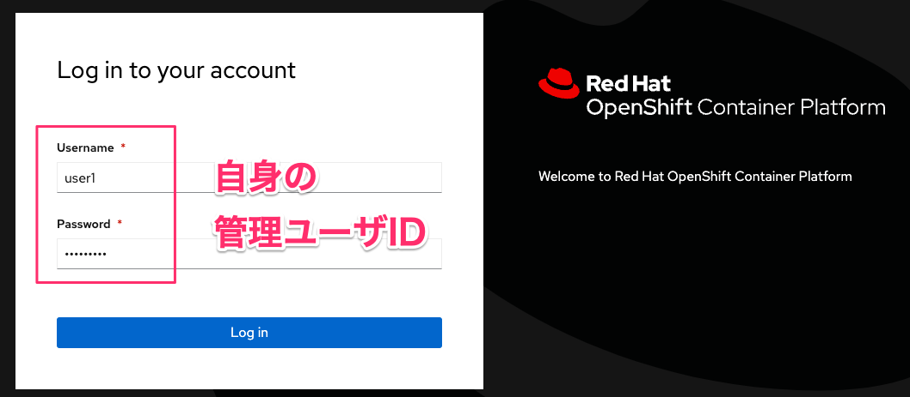
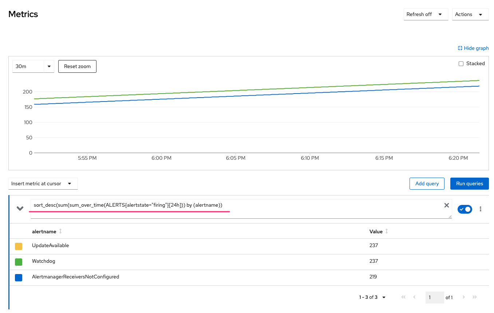
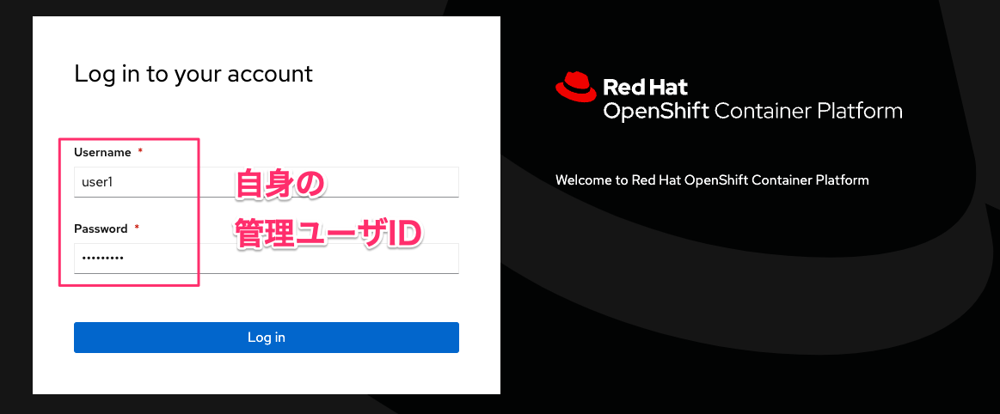

# OpenShift モニタリングハンズオン
## このハンズオンの目的

このハンズオンは OpenShift の Cluster Monitoring が提供する Prometheus, Grafana を利用した OpenShift クラスタおよびアプリケーションの監視方法を習得すること、またその仕組みの概要を実際に確認して理解することを目的とします。

---
## アジェンダ

- [1. Cluster Monitoring の監視情報へのアクセス](#1-cluster-monitoring-の監視情報へのアクセス)
  - [1.1. OpenShift Web コンソール に管理者ユーザでログイン](#11-openshift-web-コンソール-に管理者ユーザでログイン)
  - [1.2. OpenShift Web コンソール (Administrator パースペクティブ) の確認](#12-openshift-web-コンソール-administrator-パースペクティブ-の確認)
  <!--
    - [1.2.1. Overview](#121-overview)
    - [1.2.2. Project の詳細](#122-project-の詳細)
    - [1.2.3. アラート](#123-アラート)
    - [1.2.4. ダッシュボード](#124-ダッシュボード)
    - [1.2.5. メトリクス](#125-メトリクス)
  -->
- [2. Expression Browser でのメトリクス情報参照](#2-expression-browser-でのメトリクス情報参照)
  - [2.1. OpenShift Web コンソール に管理者ユーザでログイン](#21-openshift-web-コンソール-に管理者ユーザでログイン)
  - [2.2. 監視対象サンプルアプリケーションのデプロイ](#22-監視対象サンプルアプリケーションのデプロイ)
  - [2.3. Prometheus Expression Browser での PromQL クエリ実行](#23-prometheus-expression-browser-での-promql-クエリ実行)
  <!--
    - [2.3.1. Prometheus Web UI へのアクセス](#231-prometheus-web-ui-へのアクセス)  
    - [2.3.2. PromQL クエリの実行](#231-promql-クエリの実行)
  -->
- [3. 開発者向けユーザ定義 Project に対する監視の利用](#3-開発者向けユーザ定義-project-に対する監視の利用)
  - [3.1. 開発者向けユーザ定義 Project に対する監視の有効化](#31-開発者向けユーザ定義-project-に対する監視の有効化)
  - [3.2. ユーザ定義 Project に監視を設定するための権限付与](#32-ユーザ定義-project-に監視を設定するための権限付与)
  - [3.3. 監視対象サンプルアプリケーションの公開するメトリクスの確認](#33-監視対象サンプルアプリケーションの公開するメトリクスの確認)
  - [3.4. サービスの監視方法の設定](#34-サービスの監視方法の設定)
  - [3.5. アラートルールの作成](#35-アラートルールの作成)
  - [3.6. OpenShift Web コンソール (Developer パースペクティブ)](#36-openshift-web-コンソール-developer-パースペクティブ)
  <!--
    - [3.6.1. メトリクス (Developer パースペクティブ)](#361-メトリクス-developer-パースペクティブ)
    - [3.6.2. アラート (Developer パースペクティブ)](#362-アラート-developer-パースペクティブ)
    - [3.6.3. ダッシュボード (Developer パースペクティブ)](#363-ダッシュボード-developer-パースペクティブ)
  -->
- [4. クラスタで問題が発生した場合のオペレーションの流れ](#4-クラスタで問題が発生した場合のオペレーションの流れ)

--- 
## 0. ハンズオン前準備

### ユーザアカウントの割り当て
---
* Etherpad にて、user1,user2,...の箇所へ、メールアドレスを入力してください。ユーザの重複はできないので、空いている箇所へ記入をお願いします。
* **手順内に"userX"といった記載がありますが、Xの部分を自分のアカウントの番号に置き換えて実施ください。**  

## 1. Cluster Monitoring の監視情報へのアクセス

OpenShift Cluster Monitoring の Prometheus が取得したメトリクス情報は、 OpenShift の Web コンソールから確認できます。また、Prometheus、Alertmanager、Grafana、Thanos Querier といったような Web UI を提供している Cluster Monitoring のコンポーネントに直接アクセスすることも可能です。

Web コンソール上で監視情報にどのようにアクセスできるか確認をしていきます。
アクセスには clsuter-admin ロールのようなクラスタ管理権限が必要となるため、クラスタ管理ユーザを使用して確認を行います。

---

### 1.1. OpenShift Web コンソール に管理者ユーザでログイン
WebブラウザよりOpenShift Web Conosole へアクセスします。  
※URLはEtherpadの環境情報"Openshift Console"を参照  
"userX"でログインします。  
  

---

### 1.2. OpenShift Web コンソール (Administrator パースペクティブ) の確認

クラスタ管理者がクラスタレベルの監視情報や各プロジェクトの監視情報を確認するためにアクセスします。クラスタレベルの管理者権限や参照権限を持つユーザのみアクセスできます。

OpenShift クラスタにログイン後、画面左上のパースペクティブ変更ドロワーメニューから「管理者」を選択すると Administrator パースペクティブを表示できます。

  

--- 

#### 1.2.1. Overview

ドロワーメニューの「ホーム」 -> 「概要」 を選択し、クラスタの現在の状態のサマリー画面を表示します。
この画面でアラートおよびリソース使用状況の概要が確認できます。

  

例えば、ステータス欄では以下のような情報が確認でき、なにか異常がある場合は "Warning" や "Critical" アイコンが表示されます。

- Cluster : クラスタの正常性
- Controle Plane : API Server など Controle Plane コンポーネントの正常性。クリックすることで各コンポーネントのレスポンスレートを表示
- Operator : Operator の正常性。インストール済みのいずれかの Operator のステータス異常があるかどうかを確認。
- Insights : クラスタの潜在的な問題の存在有無。

--- 

#### 1.2.2. Project の詳細

「Home」 -> 「Projects」 -> <任意の Project 名> を選択して Project ごとのステータスとリソース使用状況を表示します。
例えば、 "openshift-monitoring" を検索し、 openshift-monitoring project を選択すると、 Cluster Monitoring を構成する Pod のリソース使用状況が確認できます。

  

--- 

#### 1.2.3. アラート

「Observe」 -> 「Alerting」 を選択して現在クラスタで検知し通知がされているアラートの情報を表示します。事前に通知を受け取る外部システムの設定が行われている場合、ここに表示されたアラートが設定したフィルタリングルールに則り通知されます。


また、 "Warning" や "Critical" といった重大度のアラートは Web コンソールの右上にあるベルのアイコンを選択して通知欄で確認することもできます。


現在のクラスタ環境ではクラスタアップデートが利用可能であることを示す UpdateAvailable、AlertManager が機能していることの確認のための Watchdog、外部システムへの通知が設定されていないことを示す AlertmanagerReceiverNotConfigured が通知されていることが確認できます。

通知を受け取る外部システムの設定が行われていない場合、 通知欄もしくは「Home」->「Overview」から  AlertmanagerReceiverNotConfigured アラートについて Configure を選択すると外部システムへの通知設定が行なえます。Administration -> Cluster Settings -> Global Configuration -> Alertmanager に移動することでも設定可能です。

外部システムへの通知設定はアラートレシーバを作成することで設定します。
アラートレシーバには通知を行うアラートのラベル *1 によるフィルタリング設定、レシーバタイプとして通知する外部システムを設定します。

デフォルトで定義されているレシーバは以下の 3 種類です。ただし、これらのレシーバには通知先システムを指定するレシーバタイプが設定されていないため、設定を行っていきます。 **(講師が実施します)**

-  Critical : 重大度が Critical のアラートを通知
-  Default : 他のレシーバーがキャッチしていないすべてのアラートを通知
-  Watchdog : 常にアラート通知される AlertManager が機能していることの確認通知

今回はデフォルトで定義されているレシーバに Slack Webhook を設定していきます。

アラートの通知設定を行う場合の考え方として、早急に対処が必要な重大度の高いアラートについては PagerDuty 等により電話、SMS などによる通知を行い、それ以外の重要度の高くないアラートについては Slack に通知しておき、 GitLab Issue に登録して後日対応するなど、極力不要なオペレーションを発生させない工夫をすることが推奨されます。

--- 

#### 1.2.4. ダッシュボード

「Observe」->「Dashboards」を選択するとクラスタの主要なメトリクスをグラフ化したダッシュボードを確認できます。

各ダッシュボードについてどのような情報が確認できるか一通り確認してみてください。


--- 

#### 1.2.5. メトリクス

「Observe」->「Metrics」を選択して任意のクエリ実行画面が表示します。


例えば、メトリクスの画面で「Insert example qurty(サンプルクエリーの挿入)」をクリックすると以下のクエリが挿入され、取得したメトリクス値と時系列のグラフが表示されることを確認できます。

```
sort_desc(sum(sum_over_time(ALERTS{alertstate="firing"}[24h])) by (alertname))
```



このクエリは、24 時間以内に発火(firing)されたアラートの回数をアラートごとに集計し、降順で表示するクエリとなります。このように任意のメトリクス情報は Prometheus Query Language(PromQL) 形式のクエリを実行することで確認できます。

--- 

## 2. Expression Browser でのメトリクス情報参照

前の手順では、Web コンソール上のメトリクス画面でクエリを実行しましたが、 Cluster Monitoring のメトリクス収集を担う Prometheus が持つ Expression Browser 上で PromQL クエリを実行することも可能です。
Expression Browser 上でクエリを実行し、 PromQL におけるラベルの指定方法、時間範囲の指定方法、演算子、関数の利用方法を確認します。

---

### 2.1. OpenShift Web コンソール に管理者ユーザでログイン
WebブラウザよりOpenShift Web Conosole へアクセスし、クラスタ管理ユーザでログインします。

※URLはEtherpadの環境情報"Openshift Console"を参照  
"userX"でログインします。  
  

---

### 2.2. 監視対象サンプルアプリケーションのデプロイ

監視対象となるサンプルアプリケーションを起動します。 Deployment, およびアプリケーションを公開する Service の作成を行います。

Web Terminal を起動します。


以下を Web Terminal 上で実行します。

クラスタ管理ユーザ、アプリケーション開発ユーザの ID を設定
```
$ ADMINID=<管理ユーザID>   // 例: user1
$ DEVID=<開発ユーザID>     // 例: user1-dev
```

開発者権限のユーザでログイン
```
$ oc login -u ${DEVID} -p openshift
```

Project 作成
```
$ oc new-project monitoring-example-${DEVID}
```

Deployment の作成
```
$ cat << EOF | oc apply -f -
apiVersion: apps/v1
kind: Deployment
metadata:
  labels:
    app: prometheus-example-app
  name: prometheus-example-app
  namespace: monitoring-example-${DEVID}
spec:
  replicas: 1
  selector:
    matchLabels:
      app: prometheus-example-app
  template:
    metadata:
      labels:
        app: prometheus-example-app
    spec:
      containers:
      - image: quay.io/brancz/prometheus-example-app:v0.2.0
        imagePullPolicy: IfNotPresent
        name: prometheus-example-app
        resources:
          limits:
            cpu: 500m
            memory: 100Mi
          requests:
            cpu: 50m
            memory: 50Mi
EOF
```

Service の作成
```
$ cat << EOF | oc apply -f -
apiVersion: v1
kind: Service
metadata:
  labels:
    app: prometheus-example-app
  name: prometheus-example-app
  namespace: monitoring-example-${DEVID}
spec:
  ports:
  - port: 8080
    protocol: TCP
    targetPort: 8080
    name: web
  selector:
    app: prometheus-example-app
  type: ClusterIP
EOF
```

オブジェクトの作成及び Pod の起動確認
```
$ oc get pod,svc

出力例:

NAME                                          READY   STATUS    RESTARTS   AGE
pod/prometheus-example-app-645847ddf7-7npq2   1/1     Running   0          21s

NAME                             TYPE        CLUSTER-IP       EXTERNAL-IP   PORT(S)    AGE
service/prometheus-example-app   ClusterIP   172.30.138.251   <none>        8080/TCP   9s
```
--- 

### 2.3. Prometheus Expression Browser での PromQL クエリ実行

---

#### 2.3.1. Prometheus Expression Browser に遷移

「Platform Prometheus UI」から Prometheus の Expression Browser に遷移することを確認します。

---

##### 2.3.1.1 Prometheus Web UI へのアクセス
「Networking」->「Routes」を選び、"Prometheus.." と入力して "prometheus-k8s" のRouteを検索します。

「Location」欄にあるリンクを選択し、Prometheus の Web UI にアクセスします。


<!-- 
- 「Observe」->「Metrics」を選択しクエリ入力画面に遷移します。
-->

---

##### 2.3.1.2 クラスタ管理ユーザでログイン
認証画面で「Log in with OpenShift」を選択し、 OpenShift Web コンソールログイン時と同じクラスタ管理ユーザのログイン情報を入力します。




「Authorize Access」の画面が表示された場合はチェックを変更せずに画面下部の「Allow selected permissions」を選択します。


--- 

#### 2.3.1. PromQL クエリの実行

クエリの実行例として、 OpenShift を構成するコンポーネントである API Server が OpenShift の状態変更によりそれぞれ受け付ける http リクエストの合計数を表示します。メトリクス http_requests_total から http リクエストの合計数を確認します。

PromQL クエリの基本形式：メトリック名{key=value,...}[時間範囲]

- 取得できるデータの種類
  - Instant vector：時間範囲を指定しない場合に取得できる、単一タイムスタンプでの値
  - Range vector：時間範囲を指定した場合に取得できる、複数のタイムスタンプでの値のセット
  - Scalar: 浮動小数点数で表現される数値。後述する演算子で Instant vector の値と Scalar 値を演算する事が可能

以下の各クエリの実行により PromQL におけるラベルの指定方法、時間範囲の指定方法を確認します。

- 画面上部の PromQL クエリ入力箇所に下記クエリを入力する
  - `apiserver_request_total`
  - 「Execute」を選択しクエリを実行する
  - 「Table」タブにクエリ実行結果が出力されることを確認する
   
  - 「Graph」タブに切り替えて確認する
   

---

- 上記クエリに対して `{}` 内にラベルを指定することで API Server に対する Deployments リソースに対する GET リクエストの合計数のみを表示する
  - `apiserver_request_total{code="200",endpoint="https",job="apiserver",namespace="default",resource="deployments",service="kubernetes",verb="GET"}`
  - 「Execute」を選択しクエリを実行する
  - 「Table」タブにクエリ実行結果が出力されることを確認する
    - 指定したラベル条件に一致したラベルを持つメトリクスのみ表示できていることを確認する。
    

- 上記クエリに対して `[]` 内に時間の範囲を指定することで API Server に対する http リクエストの合計数の過去 5分間に採取した値のセット (Range vector) が表示されることを確認する
  - `apiserver_request_total{code="200",endpoint="https",job="apiserver",namespace="default",resource="deployments",service="kubernetes",verb="GET"} [5m]`
  - 「Execute」を選択しクエリを実行する
  - 「Table」タブにクエリ実行結果が出力されることを確認する
    - 直近 5分間に Prometheus が採取した値のセットが表示されることを確認する
    

次に、コンテナのメモリ使用量を表示するメトリクス container_memory_working_set_bytes からコンテナのメモリ使用量を確認します。

以下の各クエリの実行により PromQL における演算子、関数の利用方法を確認します。

- PromQL で利用できる演算子と関数
  - “+” などの算術演算子
  - “>=” などの比較演算子
  - “sum” などの集計演算子 & “by” 句、”without” 句による集計単位の指定
  - “floor” などの関数を利用可能

- 集計演算子 `sum( ~ ) by (pod_name)` を利用してコンテナのメモリ使用量 (Byte 単位) を 各Pod ごとに集計し、 Scalar 値による演算( `/ 1024 / 1024` ) を行うことでMiB 単位で表示できることを確認する
  - `sum(container_memory_working_set_bytes{namespace="monitoring-example-<開発ユーザID>",container!="",image!=""} / 1024 / 1024) by (pod)`
  - 「Execute」を選択しクエリを実行する
  - 「Table」タブにクエリ実行結果が出力されることを確認する
    - Pod のコンテナのメモリ使用量が合計された値が出力されることを確認する
    
  - 「Graph」タブに切り替えてグラフが表示されることを確認する
    

---

- 上記クエリに対して関数 `floor` を利用することで小数値を切り捨てた MiB 単位で表示できることを確認する
  - `floor(sum(container_memory_working_set_bytes{namespace="monitoring-example-<開発ユーザ ID>",container!="",image!=""} / 1024 / 1024) by (pod))`
  - 「Execute」を選択しクエリを実行する
  - 「Table」タブにクエリ実行結果が出力されることを確認する
    - 小数点以下が切り捨てられたメモリ使用量が出力されることを確認する
    

PromQL のその他の演算子、関数等の詳細は Prometheus のドキュメントを参照

https://prometheus.io/docs/prometheus/latest/querying/basics/

## 3. 開発者向けユーザ定義 Project に対する監視の利用

---

### 3.1. 開発者向けユーザ定義 Project に対する監視の有効化

ユーザ定義 Project に対する監視の有効化は cluster-admin ロールを持つクラスタ管理者が行える作業となっています。そのため、特定の Project の監視を有効化したい場合は開発者がクラスタ管理者に依頼し、クラスタ管理者が有効化を実施するフローとなります。

まず、 Cluster Monitoring コンポーネントの設定を行う cluster-monitoring-config ConfigMap オブジェクトを作成し、ユーザ定義 Project に対する監視の有効化のため enableUserWorkload パラメーターを true に設定します。

**(講師が実施します)**

```
1. 管理者権限のユーザでログインする
oc login -u ${ADMINID} -p openshift

2. cluster-monitoring-config ConfigMap オブジェクトを作成
cat << EOF | oc apply -f -
apiVersion: v1
kind: ConfigMap
metadata:
  name: cluster-monitoring-config
  namespace: openshift-monitoring
data:
  config.yaml: |
    enableUserWorkload: true
EOF
```

これにより prometheus-operator、 prometheus-user-workload および thanos-ruler-user-workload Pod が openshift-user-workload-monitoring プロジェクトで実行されます。

---

確認してみましょう。

```
$ oc get pod -n openshift-user-workload-monitoring

出力例:

NAME                                   READY   STATUS    RESTARTS   AGE
prometheus-operator-5d8889776c-pt84p   2/2     Running   0          17s
```

Prometheus Operator Pod が、各Pod を作成しますので少し待ちます。

```
$ oc get pod -n openshift-user-workload-monitoring

出力例:

NAME                                   READY   STATUS    RESTARTS   AGE
prometheus-operator-5d8889776c-pt84p   2/2     Running   0          32s
prometheus-user-workload-0             5/5     Running   0          14s
prometheus-user-workload-1             5/5     Running   0          14s
thanos-ruler-user-workload-0           3/3     Running   0          14s
thanos-ruler-user-workload-1           3/3     Running   0          14s
```

--- 

### 3.2. ユーザ定義 Project に監視を設定するための権限付与

ユーザ定義 Project で監視設定を行うためには ServiceMonitor などの監視設定を行うオブジェクトを作成するための monitoring-edit 権限をアプリケーション開発ユーザに割り当てます。


管理者権限のユーザでログインする
```
$ oc login -u ${ADMINID} -p openshift
```


アプリケーション開発ユーザに monitoring-edit 権限付与
```
$ oc adm policy add-role-to-user monitoring-edit ${DEVID} -n monitoring-example-${DEVID}
```

```
$ oc adm config get-contexts

出力例:

          monitoring-example-user1-dev/172-30-0-1:443/user1   172-30-0-1:443           user1/172-30-0-1:443   monitoring-example-user1-dev
*         openshift-terminal/172-30-0-1:443/user1             172-30-0-1:443           user1/172-30-0-1:443   openshift-terminal
          user1-context                                       https://172.30.0.1:443   user1                  openshift-terminal
```

確認したコンテキスト名を指定し、アプリケーション開発ユーザへ切り替え

```
実行例: $ oc adm config use-context <確認したコンテキスト名>

$ oc adm config use-context monitoring-example-user1-dev/172-30-0-1:443/user1

Switched to context "monitoring-example-user1-dev/172-30-0-1:443/user1".
```

--- 

### 3.3. 監視対象サンプルアプリケーションの公開するメトリクスの確認

先程実行したサンプルアプリケーションは Prometheus 形式のメトリクスを `/metrics` で公開しており、Prometheus に対してサービスディスカバリの設定をすることで Prometheus でメトリクスの収集が可能です。

アプリケーションに対して oc rsh によりアプリケーションの公開するエンドポイントにローカルでアクセスし、アプリケーションの挙動とメトリクス情報の確認を行います。


アプリケーションにログイン
```
$ oc rsh deploy/prometheus-example-app
```

アプリケーションへのアクセス確認
```
~ $ wget -q -O - localhost:8080/

出力例: 

Hello from example application.
```

404エラー: /err
```
~ $ wget -q -O - localhost:8080/err

出力例: 

wget: server returned error: HTTP/1.1 404 Not Found

```

メトリクス出力: /metrics
```
~ $ wget -q -O - localhost:8080/metrics

出力例: 

# HELP http_requests_total Count of all HTTP requests
# TYPE http_requests_total counter
http_requests_total{code="200",method="get"} 1
http_requests_total{code="404",method="get"} 1
# HELP version Version information about this binary
# TYPE version gauge
version{version="v0.1.0"} 1
```

アプリケーションからログアウト
```
~ $ exit
```

--- 

### 3.4. サービスの監視方法の設定

Prometheus が app: prometheus-example-app ラベルを持つ Service オブジェクトに対してサービスディスカバリを行って監視するよう ServiceMonitor オブジェクトを作成します。

ServiceMonitor オブジェクトを作成
```
$ cat << EOF | oc apply -f -
apiVersion: monitoring.coreos.com/v1
kind: ServiceMonitor
metadata:
  labels:
    k8s-app: prometheus-example-monitor
  name: prometheus-example-monitor
  namespace: monitoring-example-${DEVID}
spec:
  endpoints:
  - interval: 30s
    port: web
    scheme: http
  selector:
    matchLabels:
      app: prometheus-example-app
EOF
```

ServiceMonitor オブジェクトを確認
```
$ oc get servicemonitor

出力例: 

NAME                         AGE
prometheus-example-monitor   11s
```

--- 

### 3.5. アラートルールの作成

サンプルアプリケーションの公開するメトリクスを元に、閾値を指定して通知を行うアラートを設定する PrometheusRule を作成します。

```
cat << EOF | oc apply -f -
apiVersion: monitoring.coreos.com/v1
kind: PrometheusRule
metadata:
  name: example-alert
  namespace: monitoring-example-${DEVID}
spec:
  groups:
  - name: example
    rules:
    - alert: HttpRequestErrorRateIncrease
      expr: rate(http_requests_total{code="404",job="prometheus-example-app"}[5m]) > 0.3
EOF
```

--- 

### 3.6. OpenShift Web コンソール (Developer パースペクティブ)

先程設定したサンプルアプリケーションに対する監視が動作していることを確認するため、Web コンソールから一度ログアウトし、開発ユーザでログインし直します。

 

 

Developer パースペクティブに切り替え


「Observe」->「monitoring-example-<開発ユーザID>」プロジェクトを開く


--- 

#### 3.6.1. メトリクス (Developer パースペクティブ)

「Obserbe」->「Metrics」タブから任意のクエリを実行できます。ただし、出力結果は監視を有効にした Project の範囲となります。

クエリの種類として「カスタムクエリ」を選択し、 `http_requests_total` クエリを実行するとサンプルアプリケーションが `/metrics` エンドポイントで公開しているメトリクスを取得できることが確認できます。


--- 

#### 3.6.2. アラート (Developer パースペクティブ)

「Obserbe」->「Alerting」タブから PrometheusRule で定義したアラートを確認できます。


実際にアラートが通知される状況を作り出し、アラート状態が「Firing」になることを確認します。

コンソール右上から、Web Terminal を起動 (起動していない場合)


アプリケーションにログイン
```
$ oc rsh deploy/prometheus-example-app
```

HTTP リクエストエラーの急増を再現
```
実行例: 

~ $ for i in `seq 1 100`
do
  wget -q -O - localhost:8080/err
done

出力例:
...
wget: server returned error: HTTP/1.1 404 Not Found
wget: server returned error: HTTP/1.1 404 Not Found
wget: server returned error: HTTP/1.1 404 Not Found
wget: server returned error: HTTP/1.1 404 Not Found
wget: server returned error: HTTP/1.1 404 Not Found
...

```

アプリケーションからログアウト
```
~ $ exit
```

アラート状態が、「Firing」になっていることを確認


--- 

#### 3.6.3. ダッシュボード (Developer パースペクティブ)

「Observe」->「Dashboards」タブからリソース使用率等の情報を確認できます。


## 4. クラスタで問題が発生した場合のオペレーションの流れ

実際の運用時に OpenShift の Prometheus クラスターモニタリング、 EFK スタックを利用する場合は以下の流れで障害調査を行います。

1. AlertManager でサービス継続不可時のアラートを検知
2. Grafana で事象発生時刻のメトリクス情報を確認
3. Kibana で事象発生時刻のログを解析

障害調査の例として、意図的にメモリ高負荷により Pod が再起動した状況を作り出し、サービス継続不可時のアラートが検知された想定で調査の流れを確認します。

NOTE: Grafana, Kibana でリソース使用量の傾向やログが確認できない場合、Dashboard の表示期間を変更することで解決しないか確認する。

- Pod で意図的にメモリ高負荷状態を発生させ、コンテナを再起動させる

  ```
  1. プロジェクトの選択
  $ oc project monitoring-example-${DEVID}
  Now using project "monitoring-exampleXX" on server "https://master.rbfesmw-XXXX.open.redhat.com:443".

  2. テスト用アプリケーションの起動
  $ oc new-app registry.redhat.io/jboss-webserver-5/webserver53-openjdk8-tomcat9-openshift-rhel7~https://github.com/openshiftdemos/os-sample-java-web.git
  $ oc set resources deployment os-sample-java-web --requests=cpu=100m,memory=256Mi --limits=cpu=200m,memory=512Mi

  3. oc rsh <Pod名> で Pod の shell セッションを確立し、メモリ負荷をかけるコマンドを実行する
  # しばらくしてリモートシェルセッションが終了コード 137 で終了することを確認する、この時点でコンテナがメモリ高負荷により再起動している
  # ※終了までに 1 分程度かかる場合があります。
  $ oc rsh deployment/os-sample-java-web
  sh-4.2$ for num in {1..40}; do /dev/null < $(yes) & done
  [1] 52794
  [2] 52795
  [3] 52796
  [4] 52798
  [5] 52800
  [6] 52802
  [7] 52805
  [8] 52807
  [9] 52809
  [10] 52811
  sh-4.2$ command terminated with exit code 137
  ```

- Web コンソール / Grafana でリソース使用量を確認する
  - 障害が発生した時刻(メモリ負荷をかけた時刻) の Dashboard 「K8s / Compute Resources / Namespace」を確認する。
    - 「Memory Usage」から該当 Pod のメモリ使用量が上昇し、その後急激に減少していることを確認する(コンテナが再起動されたため)
    - 「Memory Quota」の Pod 一覧から該当 Pod名 を選択し、Dashboard 「K8s / Compute Resources / Pod」に遷移することで該当 Pod にドリルダウンしてメトリクス情報を確認することも可能

- Kibana で Pod のログを表示する
  - Kibana で以下のクエリを実行し、該当時刻のコンテナ再起動後に新しい Pod でプロセスが正常起動していることを確認する
    - `kubernetes.namespace_name:"monitoring-example-<開発ユーザ ID>" AND kubernetes.pod_name:"<対象 Pod 名>" AND message:"org.apache.catalina.startup.Catalina.start Server startup"`
